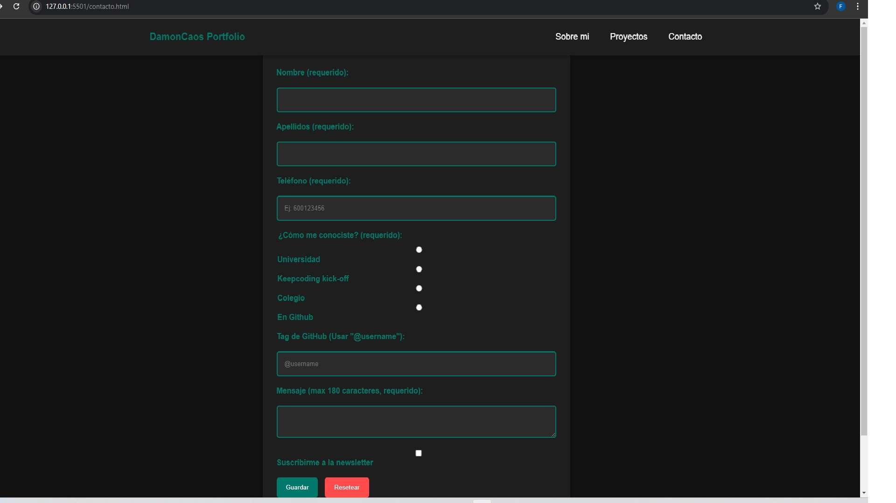
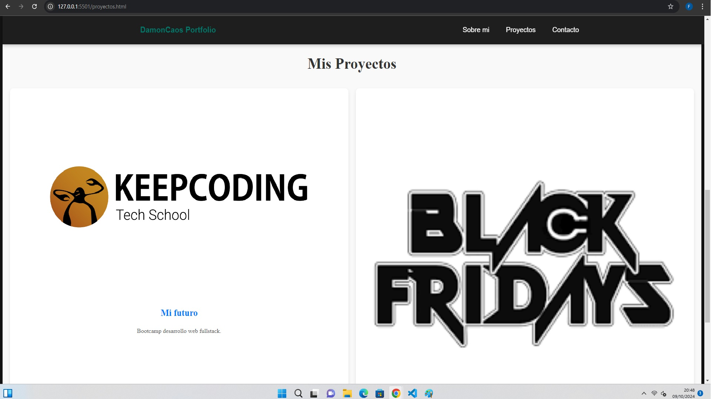

# Mi Portfolio

Bienvenido a mi portfolio, donde muestro mis proyectos, habilidades y experiencia en desarrollo web.

## Descripción

Este es un portfolio personal diseñado para exhibir mis proyectos y habilidades en desarrollo web. Aquí podrás encontrar información sobre mí, mis proyectos y un formulario de contacto para conectarte conmigo.

## Tecnologías Utilizadas

- HTML
- CSS


## Características

- Navegación intuitiva.
- Sección de proyectos en estilo grid.
- Formulario de contacto funcional.
- Diseño responsivo para dispositivos móviles.

## Capturas de Pantalla





## Instalación

Para ver el proyecto en tu máquina local, sigue estos pasos:

1. Clona el repositorio:
   ```bash
   git clone https://github.com/DamonCaos/Practica-fundamentos-HTML-y-CSS
